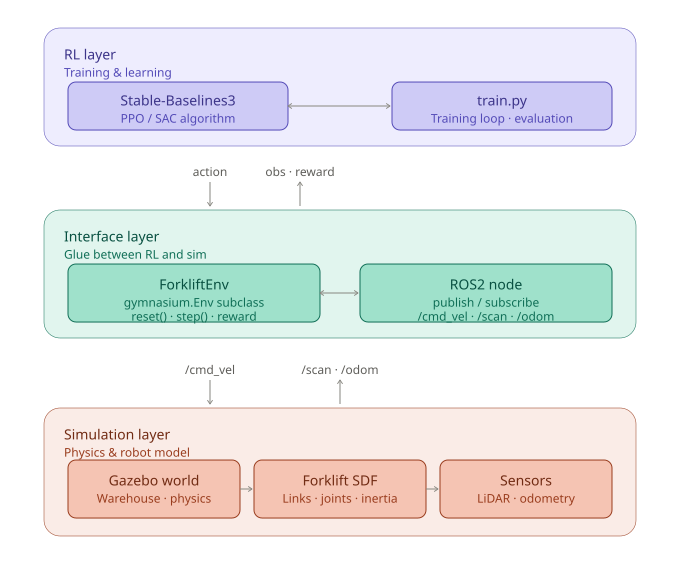

# Phase 1 System Architecture

**Project**: miniature-forklift-rl  
**Phase**: Phase 1 — Gazebo Simulation & Basic Navigation  
**Created**: 2026-05-19

---

## Overview

Four components — RL (SB3), interface (Gymnasium), middleware (ROS2), and simulator (Gazebo) — are connected in a three-layer structure.



---

## Component Roles

### RL Layer

| Component | Role |
|---|---|
| `Stable-Baselines3` | Trains the agent using PPO / SAC. Has no knowledge of Gazebo. |
| `train.py` | Entry point for the training loop, evaluation, and model saving. |

### Interface Layer (most critical)

| Component | Role |
|---|---|
| `ForkliftEnv` | Subclass of `gymnasium.Env`. Implements the `reset()` / `step()` interface that SB3 expects. Reward calculation lives here. |
| `ROS2 node` | Runs inside `ForkliftEnv`. Publishes actions (velocity commands) to Gazebo and subscribes to sensor data. |

> **Design decision**: This layer is the glue holding the entire stack together. Getting the structure wrong here means rebuilding everything — lock down the design before writing other components.

### Simulation Layer

| Component | Role |
|---|---|
| `Gazebo world` | SDF world file defining the warehouse environment. Runs the DART physics engine. |
| `Forklift SDF` | Robot model file defining links, joints, and inertial parameters. |
| `Sensors` | LiDAR, camera, etc. Defined as Gazebo plugins inside the SDF; data is published to ROS2 topics. |

---

## Data Flow

```
train.py
  └─ SB3.learn()
       └─ ForkliftEnv.step(action)
            ├─ ROS2 publish  → /cmd_vel   (velocity command to Gazebo)
            ├─ ROS2 subscribe ← /scan     (LiDAR observation)
            ├─ ROS2 subscribe ← /odom     (position and velocity)
            └─ return obs, reward, terminated, truncated, info
```

---

## Recommended Task Order

1. **Forklift SDF/URDF** — minimal model (two wheels is enough to start)
2. **Gazebo world** — flat plane with walls only
3. **ForkliftEnv skeleton** — `step()` just sends a velocity command for now
4. **Smoke test with a random agent** — run `env.step(env.action_space.sample())` without SB3
5. **Design reward function and observation space**
6. **Start training with SB3**

> **Checkpoint**: Confirm all three layers are connected at step 4 before moving further.

---

## Confirmed Tech Stack

| Item | Version |
|---|---|
| Ubuntu | 24.04.4 LTS |
| ROS2 | Jazzy |
| Gazebo | Harmonic 8.11.0 |
| Python | 3.12.3 |
| PyTorch | 2.5.1+cu121 |
| Stable-Baselines3 | 2.8.0 |
| Gymnasium | 1.2.3 |